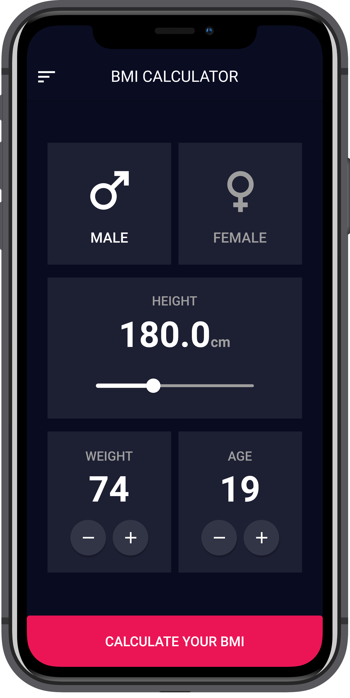

# :beginner: BMI CALCULATOR

Simple bmi calculator.

## :book: Table of contents

- [General info](#general-info)
- [Technologies](#technologies)
- [Screenshots](#screenshots)
- [Setup](#setup)

## :pencil: General info

Bmi calculator created with Cubit as a state management package.

[UI Design](https://dribbble.com/shots/4585382-Simple-BMI-Calculator)

## :gear: Technologies

Project is created with:

- [Flutter](https://flutter.dev/) version: 2.2.0
- [Dart](https://dart.dev/) version: 2.13.0
- [Flutter_bloc](https://pub.dev/packages/flutter_bloc) version: 7.0.0
- [Hexcolor](https://pub.dev/packages/hexcolor) version: 2.0.3
- [Device_preview](https://pub.dev/packages/device_preview) version: 0.7.1

## :camera_flash: Screenshots

 

## :computer: Setup

To run this project follow these steps:

1. Clone the repository

```
$ git clone https://github.com/jakubjaniec/bmi-calculator.git
```

2. Open the project

```
$ cd bmi-calculator
```

3. Install dependencies

```
flutter pub get
```

4. Run app

```
$ flutter run
```
